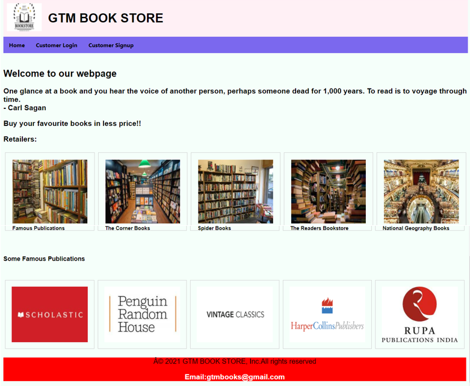

# Online Book Shopping Website

This project is an online book shopping website built using HTML, PHP, MySQL, and XAMPP. It provides users with the ability to browse, add books to their cart, and checkout by entering their address and contact number. Administrators can add, update, and delete books from the database.

## Features

1. **Admin Functionality**: Administrators can add, update, and delete books from the database.
2. **Homepage Display**: Newly added books are displayed on the homepage.
3. **Index Page**: Provides website information, retailers, and publications. Users can sign up or login.
4. **User Registration**: New users must sign up and register their details.
5. **User Authentication**: Registered users can log in using their credentials.
6. **Browse Books**: Users can view various books in different categories.
7. **Book Description**: Clicking on a book reveals detailed information like price, author, and publisher.
8. **Add to Cart**: Users can add books to their cart, specifying the quantity required.
9. **View Cart**: Users can view their cart, containing a summary of added books and total price.
11. **Remove from Cart**: Users can remove a book from the cart.
12. **Checkout**: Users can confirm their order by entering contact information and delivery address.
13. **Order Confirmation**: Upon successful checkout, a confirmation message is displayed, and the order details are stored in the database.
14. **Print or Save Confirmation**: Users can print or save the order confirmation.

## Technologies Used

- **HTML**: For front-end structure.
- **PHP**: For server-side scripting.
- **MySQL**: For database management.
- **XAMPP**: For local development environment setup.

## Instructions for Setup

1. Install XAMPP on your local machine.

2. Clone this repository into the htdocs folder of your XAMPP installation.

3. Import the provided MySQL database schema.

4. Start the Apache and MySQL servers using XAMPP Control Panel.

5. Open a web browser and navigate to `http://localhost/online-bookstore`.

## Screenshots

1. Homepage

